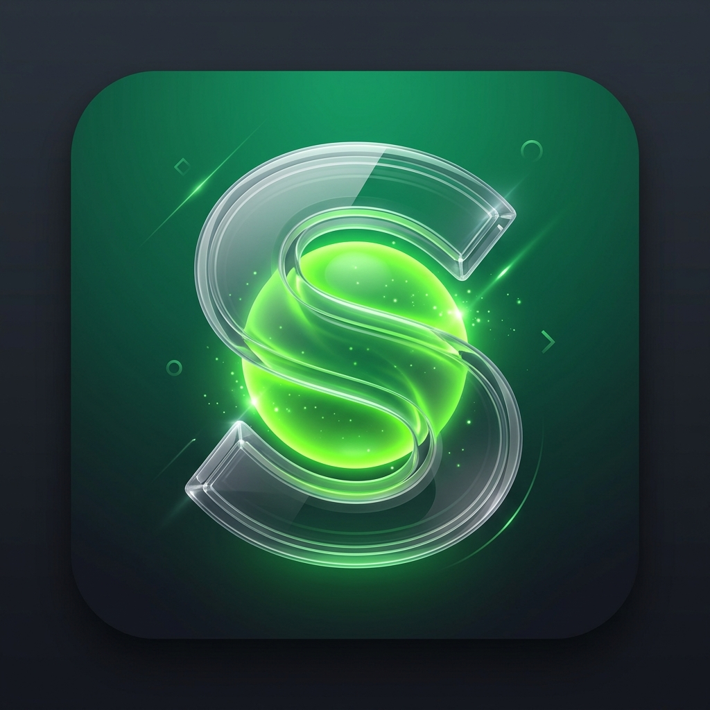
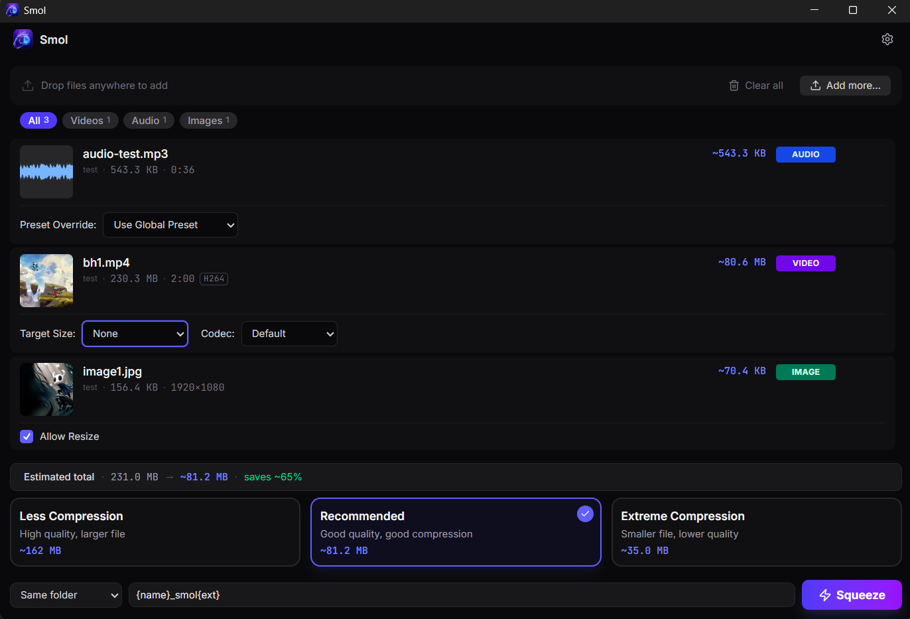
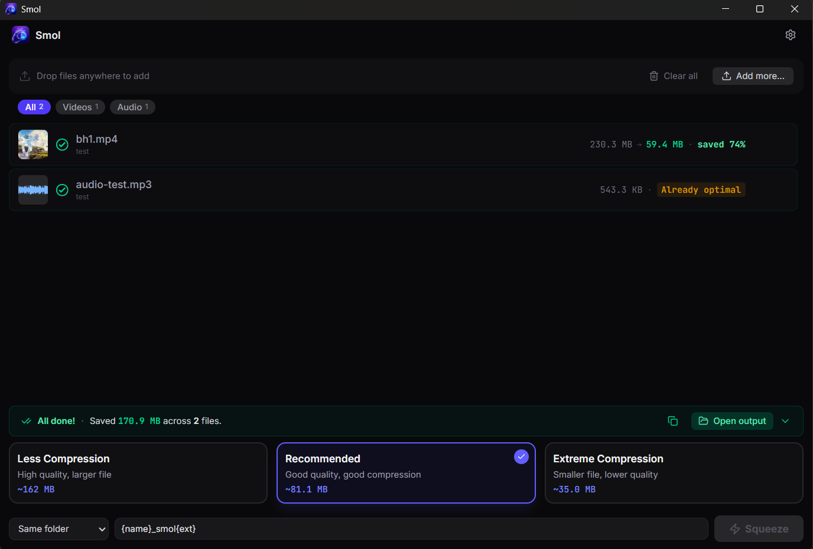
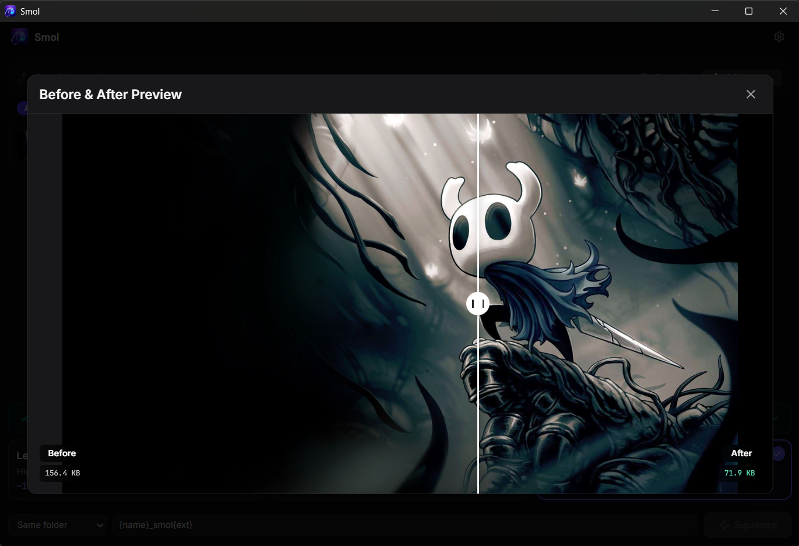

<div align="center">
  
  <h1>Squeeze</h1>
  <p><strong>The file compressor that stays out of your way.</strong><br/>Drop any mix of videos, audio, images, and PDFs. Hit Squeeze. Done.</p>

  <p>
    <a href="https://github.com/abdelrahman252/squeeze/actions/workflows/release.yml"></a>
    <a href="https://github.com/abdelrahman252/squeeze/releases/latest"></a>
    <a href="https://github.com/abdelrahman252/squeeze/blob/main/LICENSE"></a>
  </p>

  <a href="https://github.com/abdelrahman252/squeeze/releases/latest/download/Squeeze_1.0.0_x64-setup.exe">
    
  </a><br/>
  <em>Windows 10 / 11 · 64-bit · ~70 MB</em>
  <br/><br/>
</div>

---

## Why Squeeze?

Most compression tools make you juggle separate apps for video, audio, images, and PDFs. Squeeze handles all four in a single drag-and-drop queue. Everything runs **100% locally** , your files never leave your machine.

| | |
|---|---|
| **No uploads, ever** | All compression runs locally using FFmpeg, Ghostscript, and native Rust libraries. Your files stay yours. |
| **Bilingual & RTL** | Full Arabic & English support with native Right-to-Left layout flipping for a comfortable bilingual experience. |
| **Light & Dark Theme** | Fluid light and dark theme styling with persistent preference savings. |
| **Secure Auto-Updates** | Integrates built-in, secure app updater checks directly from GitHub Releases. |
| **Hardware-accelerated video** | Automatically uses your NVIDIA, Intel, or AMD GPU for video encoding , no manual setup needed. |
| **One queue, every format** | MP4, MKV, MOV, MP3, FLAC, JPEG, PNG, WebP, AVIF, and PDF , all in one drop zone. |

---

## Features

### Unified Drop Zone
Drop any mix of file types at once. Squeeze detects each format and routes it to the correct engine automatically. Filter by kind using the chips above the queue , or just squeeze everything at once.

### Per-File Precision
Set a specific target size on individual files right inside the queue row , e.g. exactly 8 MB for a Discord upload , without changing the global preset for the rest of the batch.

### Bilingual (EN/AR) & Light Mode
Toggle between English and Arabic with full Right-to-Left (RTL) layout support, and swap themes dynamically using theSun and Moon header buttons. Your configuration is automatically persisted.

### Secure Auto-Updates
When launching, Squeeze checks for signed releases on GitHub and prompts you to update automatically so you always have the latest tools.

### Three Plain-English Presets
**Less Compression** · **Recommended** · **Extreme Compression**. No CRF values, no bitrate sliders, no jargon. Recommended is the default and hits the best quality-to-size balance for almost every file.

### "Already Optimal" Detection
If compressing a file would make it *larger*, Squeeze stops and marks it as **Already optimal** rather than wasting your time with a bloated output.

### Instant Retry
Failed job? Hit the retry button directly on the queue row. No need to re-add the file or re-run the whole queue.

### Before / After Preview
A visual slider lets you compare the original and compressed output side by side, with exact file sizes displayed under each label.

---

## See it in action

### Seamless Compression Flow

https://github.com/user-attachments/assets/7449709d-c937-474a-b764-866df209bef8

*Drop files, pick a preset, and hit Squeeze. The queue runs instantly and seamlessly.*

---

### Buttery Smooth UI

https://github.com/user-attachments/assets/42d4dce6-fa8c-4c93-9ae9-fde20ee5b2eb

*Built with Framer Motion for premium, native-feeling layout animations and state transitions.*

---

### Precision Per-File Settings

<div align="center">
  
  <br/><em>Set a precise target size per file , perfect for Discord, email, or social media limits.</em>
</div>

<br/>

### Massive Savings

<div align="center">
  
  <br/><em>See exactly how much space you saved, file by file, the moment compression finishes.</em>
</div>

<br/>

### Before / After Preview

<div align="center">
  
  <br/><em>The built-in before/after slider lets you visually validate quality before keeping the output.</em>
</div>

---

## Building from source

**Prerequisites:** Rust stable · Node.js 22+ · npm 10+

```bash
git clone https://github.com/abdelrahman252/squeeze
cd squeeze
npm install
node scripts/fetch-ffmpeg.mjs
node scripts/fetch-ghostscript.mjs
npm run tauri dev
```

> **Note:** Squeeze uses pinned FFmpeg and Ghostscript sidecar binaries. Run the two fetch scripts before `npm run tauri dev` , the app will not start without them.

---

## License

Squeeze is free and open source software, licensed under the **[GNU Affero General Public License v3.0](LICENSE)**.
